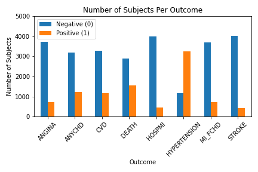
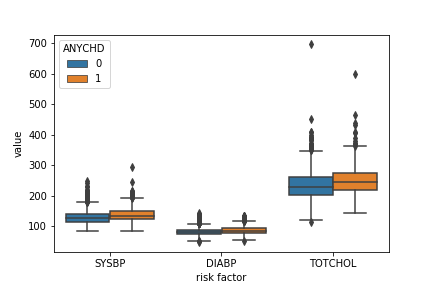

# Machine Learning Exploration Project

A dataset of clinical data was used to explore the ability of different machine algorithms to predict cardiovascular disease events. For the live site of our project, [click here](https://kmcgrath88.github.io/FraminghamML-Project/summary.html).

<!-- TABLE OF CONTENTS -->
## Table Of Contents

* [Framingham Heart Study](#framingham-heart-study)
* [Study Data](#study-data)
* [Our Project](#our-project)
  * [Built With](#built-with)
* [Data Processing](#data-processing)
* [Machine Learning Exploration](#machine-learning-exploration)
* [Data Visualization](#data-visualization)
* [Findings](#findings)
* [Team Members](#team-members)

<!-- Framingham Heart Study -->
## Framingham Heart Study

The Framingham Heart Study is a long-term prospective study, beginning in 1948, of the etiology of cardiovascular disease among a population of subjects in the community of Framingham, MA. This was the first prospective study of cardiovascular disease and identified the concept of risk factors and their joint effects.

The study began in 1948, with 5,209 subjects initially enrolled. Each subject was examined biennially and were regularly surveilled for cardiovascular disease outcomes. Key findings from this study include determing the importance of high blood pressure and high cholesterol are risk factors for cardiovascular disease.  [Additional study information](https://www.nhlbi.nih.gov/science/framingham-heart-study-fhs)

<!-- Study Data -->
## Study Data

The data used in this project is a subset of the entire study data set obtained from the NHLBI as a [teaching data set](https://biolincc.nhlbi.nih.gov/teaching/). There were 4,434 participants included in this data set, with clinical data obtained from 1-3 examinations from 1956-1968. Each participant was followed for a total of 24 years. 

**Risk factors included in the data set:**
* Sex
* Age
* Systolic Blood Pressure	
* Diastolic Blood Pressure
* Use of anti-hypertensive medications
* Current cigarette smoking
* Number of cigarettes smoked per day
* Serum total cholesterol
* BMI			
* Casual serum glucose
* Diabetes		
* Heart rate
* Prevalent cardiovascular disease conditions at time of exam

**Outcomes recorded:**
* Angina Pectoris	
* Any Coronary Heart Disease
* Cerebrovascular Disease
* Hospitalization for Myocardial Infarction
* Myocardial Infarction or Fatal Coronary Heart Disease
* Hypertension
* Stroke
* Death from any cause

<!-- Our Project -->
## Our Project

<!-- Built With -->
### Built With

Our project was built using the following frameworks/libraries/databases: 
* Python 
* Scikit-learn
* Pandas
* Matplotlib
* Tableau
* HTML
* CSS

<!-- Data Processing -->
## Data Processing

The initial data was obtained as a .csv file with 11,627 rows of data from 4,434 subjects. Each row contains risk factor and event data for a single subject from a given examination period. Each subject has between 1 - 3 examination periods (roughly 2 years between each examination period for a given subject). For these analyses we focused on period #1 (baseline) as it had the most data (4,434 subjects vs. 3,263 subjects in period #3). An outcome-specific data file was generated for each outcome, in which the subjects with the relevant prevelant disease condition were filtered out (e.g. for the stroke classifier each subject who had already had a stroke prior to their period 1 examination (PREVSTRK = 1) were filtered out of the data set). In addition, any rows with missing values were removed from the outcome-specific data file prior to running classifiers.  Data files are located in the resource folder.  Scripts for data processing can be found in the jupyter notebooks folder.

<!-- Machine Learning Exploration -->
## Machine Learning Exploration

Python's [scikit-learn](https://scikit-learn.org/stable/index.html) was used to run predictive analyses for each outcome across 4 different machine learning algorithms:
* logistic regression
* k-nearest neighbor
* random forest
* support vector machine

The performance of each algorithm was assessed according to predicted and actual outcomes and the following testing metrics:
* accuracy	
* precision
* recall
* f1-measure

Scripts for each the machine learning prediction analyses are located in the appropriate titled folder located within the jupyter notebooks folder.

<!-- Data Visualization -->
## Data Visualization

Visualizations of the data exploration and analyses can be found at the [project website](https://kmcgrath88.github.io/FraminghamML-Project/summary.html).  Visualizations include:
 * comparing the different age groups across the cardiovascular event outcomes using Tableau.
 * summary visualizations of test performance for each event outcome
 * ranking of feature importance for the random forest classifier

<!-- Findings -->
## Findings

We found that the class imbalance in a predicted outcome significantly affected which testing metric accurately measured the performance of machine learning algorithm.  For outcomes with highly imbalanced classes (e.g. MI_FCHD: negative event = 3703, positive event = 731) using test accuracy is a very misleading metric, as the number of correctly called negatives far outweighs the small percentage of correctly called positives.  A better test metric then, is the f1- measure, which is the harmonic mean of the precision and recall.  

We also found that support vector machines (SVMs) seemed to perform better than the other machine learning algorithms, especially for outcomes with imbalanced classes.  SVMs tended to have the highest F1-measure for each outcome and generally predicted a greater number of true positives than the other algorithms.

<!-- Team Members -->
## Team Members
* [ Todd Auman ](https://github.com/jtauman)
* [ Bobby Huffstetler ](https://github.com/bhuffstetler)
* [Jamie Lam](https://github.com/jwlam)
* [ Kristi McGrath ](https://github.com/kmcgrath88)
